# Awesome-3D-Medical-Imaging-Segmentation

 

**👉 Please consider giving this repository a star ⭐ if you find it helpful!**

## News

### [02/09/2024] Our literature review paper is ongoing, will be released soon!
### [02/08/2024] The repo is currently updating, you can follow it for the latest updates!

> **U-Net v2: Rethinking the Skip Connections of U-Net for Medical Image Segmentation** 
> Yaopeng Peng, Milan Sonka, Danny Z. Chen 
> _**Preprint**_ 
>   
> 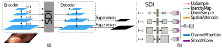

> **SegVol: Universal and Interactive Volumetric Medical Image Segmentation** 
> Yuxin Du, Fan Bai, Tiejun Huang, Bo Zhao 
> _**Preprint**_ 
>   
> 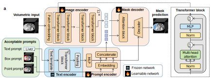

> **MGDC-UNet: Multi-group Deformable Convolution for Medical Image Segmentation** 
> Anonymous 
> _**Preprint**_ 
>  
> 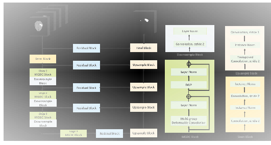

> **DeformUX-Net: Exploring a 3D Foundation Backbone for Medical Image Segmentation with Depthwise Deformable Convolution** 
> Anonymous 
> _**Preprint**_ 
>  
> 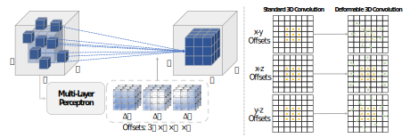

> **Beyond Self-Attention: Deformable Large Kernel Attention for Medical Image Segmentation** 
> Reza Azad, Leon Niggemeier, Michael Huttemann, Amirhossein Kazerouni, Ehsan Khodapanah Aghdam, Yury Velichko, Ulas Bagci, Dorit Merhof 
> _**WACV 2024**_ 
>    
> 

> **SwinMM: Masked Multi-view with Swin Transformers for 3D Medical Image Segmentation** 
> Yiqing Wang, Zihan Li, Jieru Mei, Zihao Wei, Li Liu, Chen Wang, Shengtian Sang, Alan Yuille, Cihang Xie, Yuyin Zhou 
> _**MICCAI 2023**_ 
>    
> 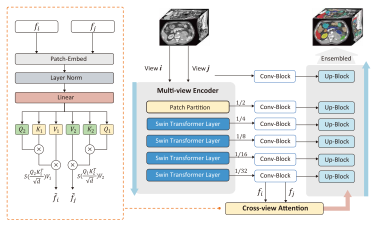

> **Multi-scale Hierarchical Vision Transformer with Cascaded Attention Decoding for Medical Image Segmentation** 
> Md Mostafijur Rahman, Radu Marculescu 
> _**MIDL 2023**_ 
>     
> 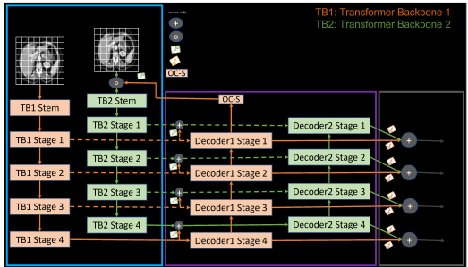

> **Improved Abdominal Multi-Organ Segmentation via 3D Boundary-Constrained Deep Neural Networks** 
> Samra Irshad, Douglas P.S. Gomes, Seong Tae Kim 
> _**IEEE Access 2023**_ 
>    
> 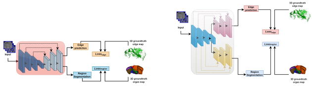

> **Large-Kernel Attention for 3D Medical Image Segmentation** 
> Hao Li, Yang Nan, Javier Del Ser, Guang Yang 
> _**Cognitive Computation 2023**_ 
>   
> 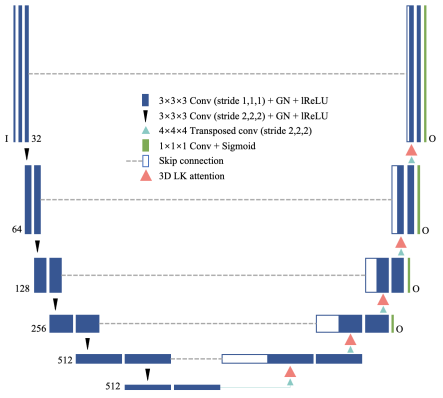

> **Dynamic Linear Transformer for 3D Biomedical Image Segmentation** 
> Zheyuan Zhang, Ulas Bagci 
> _**MLMI 2022**_ 
>    
> 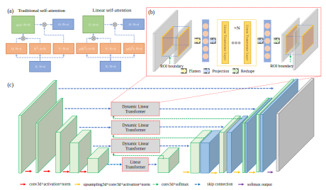

> **PHTrans: Parallelly Aggregating Global and Local Representations for Medical Image Segmentation** 
> Wentao Liu, Tong Tian, Weijin Xu, Huihua Yang, Xipeng Pan, Songlin Yan, Lemeng Wang 
> _**MICCAI 2022**_ 
>    
> 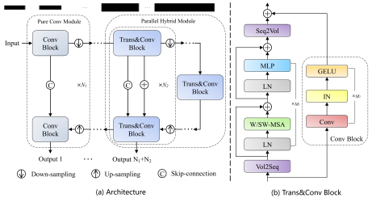

> **CAN3D: Fast 3D Medical Image Segmentation via Compact Context Aggregation** 
> Wei Dai, Boyeong Woo, Siyu Liu, Matthew Marques, Craig B. Engstrom, Peter B. Greer, Stuart Crozier, Jason A. Dowling, Shekhar S. Chandra 
> _**MIA 2022**_ 
>   
> 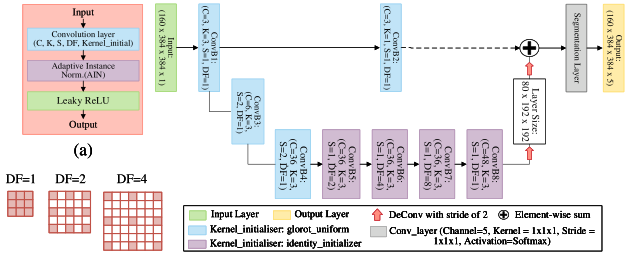

> **KiU-Net: Overcomplete Convolutional Architectures for Biomedical Image and Volumetric Segmentation** 
> Jeya Maria Jose, Vishwanath Sindagi, Ilker Hacihaliloglu, Vishal M. Patel 
> _**TMI 2021**_ 
>   
> 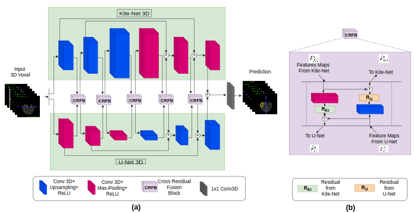

> **KiU-Net: Towards Accurate Segmentation of Biomedical Images using Over-complete Representations** 
> Jeya Maria Jose, Vishwanath Sindagi, Ilker Hacihaliloglu, Vishal M. Patel 
> _**MICCAI 2020 Oral**_ 
>     
> 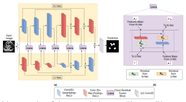
